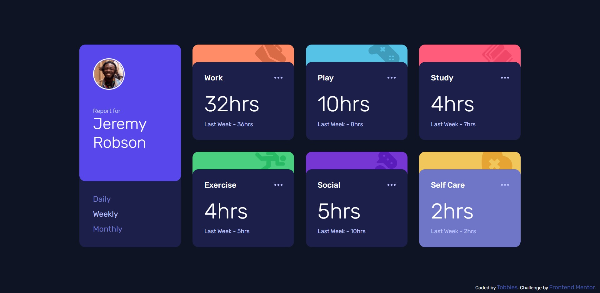

# Frontend Mentor - Time tracking dashboard solution

This is a solution to the [Time tracking dashboard challenge on Frontend Mentor](https://www.frontendmentor.io/challenges/time-tracking-dashboard-UIQ7167Jw). Frontend Mentor challenges help you improve your coding skills by building realistic projects. 

## Overview

### The challenge

Users should be able to:

- View the optimal layout for the site depending on their device's screen size
- See hover states for all interactive elements on the page
- Switch between viewing Daily, Weekly, and Monthly stats

### Screenshot

## My process

- Take a look for this challenge.
- Give the general solution in my mind
- Start coding Structure.
- Markup with CSS
- DONE!

### Built with

- Semantic HTML5 markup
- CSS custom properties
- Flexbox
- CSS Grid

## Author

- Github - [@tobbiesfake](https://www.github.com/tobbiesfake)
- Frontend Mentor - [@tobbiesfake](https://www.frontendmentor.io/profile/tobbiesfake)
